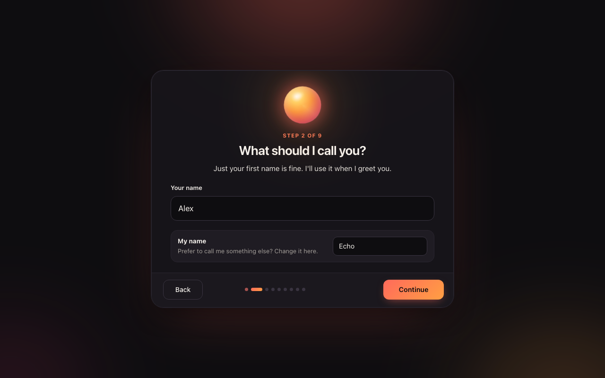
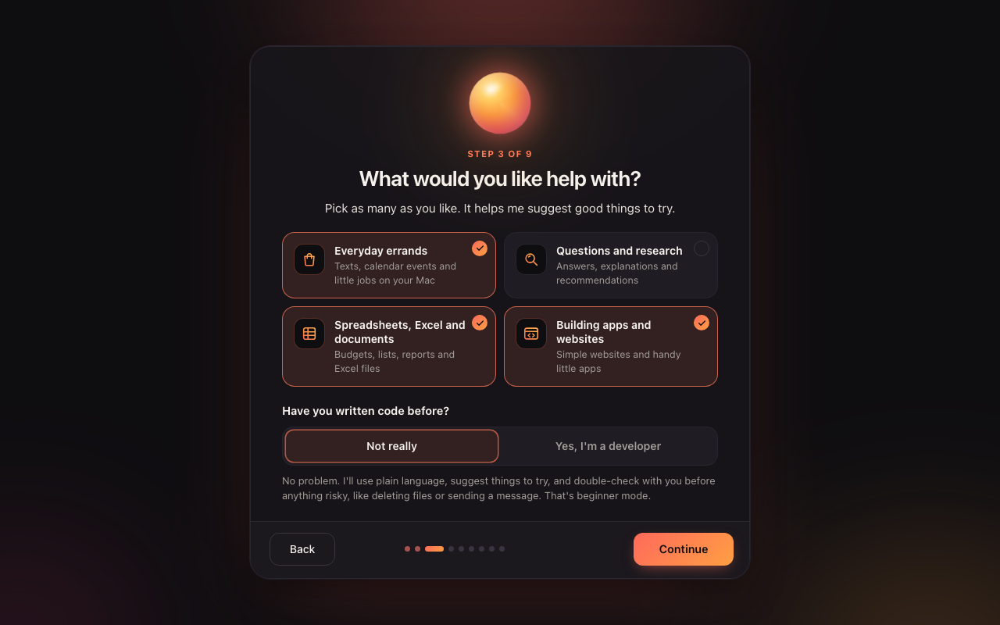
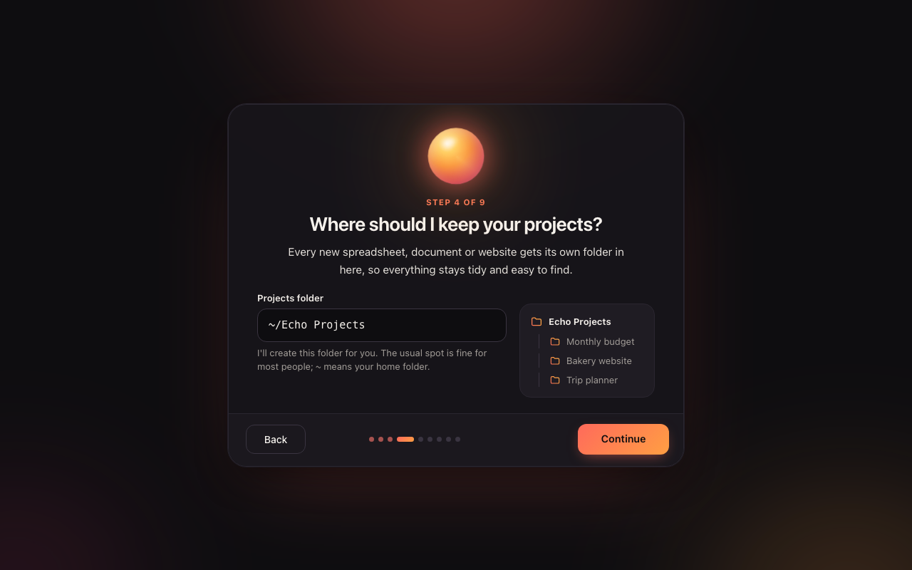
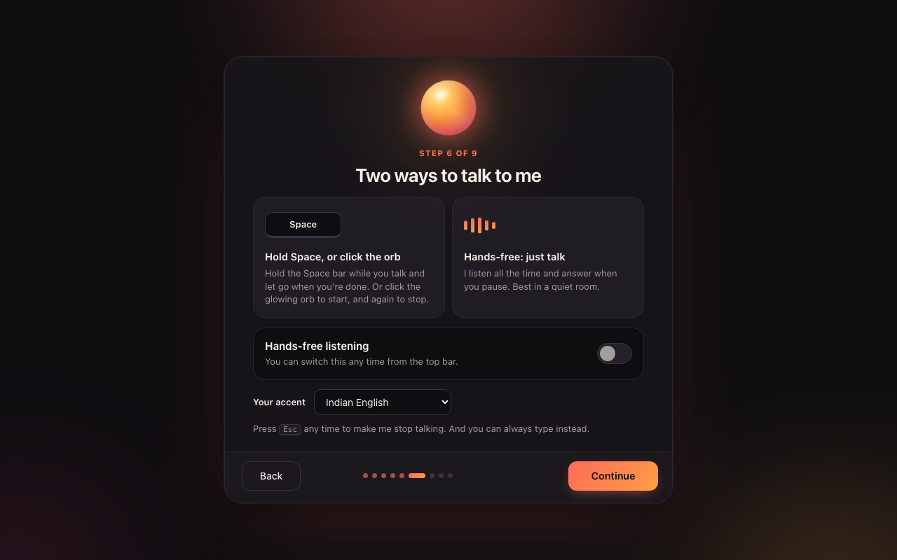
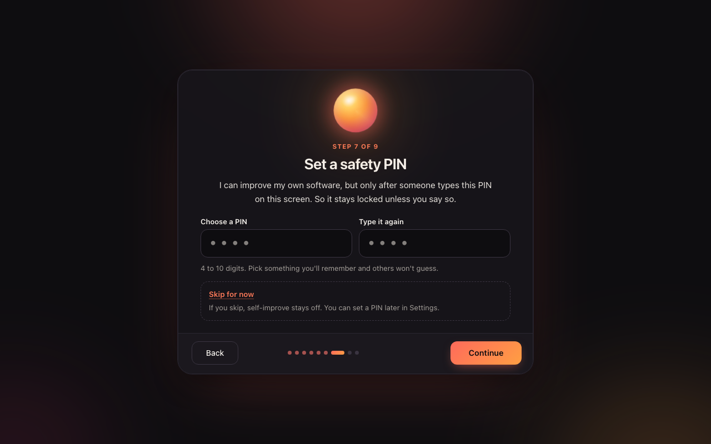
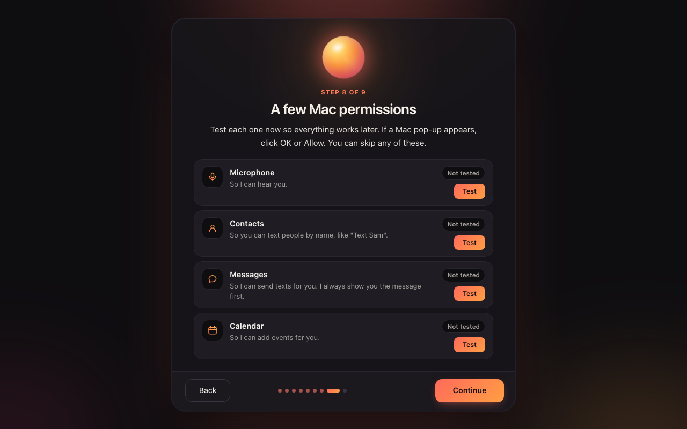
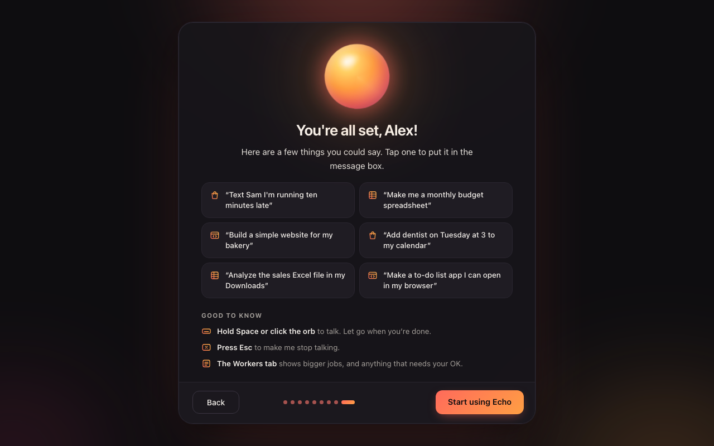

# Getting started with Echo

Echo is a voice assistant for your Mac. You talk to it, and it gets things done: texts, calendar events, questions, spreadsheets, documents, and even simple websites. It runs on your own Mac and uses your own Claude account.

This guide takes about 15 minutes, most of it waiting for downloads.

## What you need

- **A Mac** running a recent macOS, with an internet connection.
- **A Claude subscription** (Claude Pro or Max), from [claude.ai](https://claude.ai). Echo uses it to think. The subscription is yours, so what you do with Echo stays in your account.
- Nothing else. (If the Echo app can't be built on your Mac, Echo opens in your browser instead; **Google Chrome** is best at using the microphone there.)

## 1. Install Echo

**The quickest way:** open the **Terminal** app, paste the one-line install command from Echo's GitHub page, and press Return. It does everything below by itself, then opens Echo. Or, if someone gave you **Echo.zip**:

1. Unzip **Echo.zip** (double-click it). You'll get a folder called **Echo**.
2. Open the folder and double-click **install.command**.
   - If your Mac says it "can't be opened because it is from an unidentified developer", right-click (or Control-click) **install.command** and choose **Open**, then **Open** again.
   - On newer Macs you may instead need to open **System Settings → Privacy & Security**, scroll down, and click **Open Anyway** next to install.command.
   - Still stuck? Open the **Terminal** app, type `zsh ` (with a space), drag **install.command** into the Terminal window, and press Return.
3. A Terminal window opens and walks you through everything. Press **Return** to accept each suggestion. It will:
   - install **Node.js** (the engine Echo runs on) if your Mac doesn't have it,
   - download the pieces Echo needs,
   - install **Claude Code** and help you **sign in** to Claude: a browser window opens, you sign in with your Claude account, then come back to Terminal,
   - optionally set up **free, private speech recognition** (Whisper) and **Echo's natural voice** (Kokoro),
   - create the **Echo** app in your Applications folder, and offer to put it in your Dock. The app is built right on your Mac with Apple's free **Command Line Tools**. If those aren't installed, the installer offers to get them: a window from Apple appears, click **Install**. If you'd rather not, Echo opens in your browser instead.
4. When you see **All set!**, press Return to close the window.

You only do this once.

## 2. Open Echo

Click **Echo** in your Dock, or find it in Launchpad or in the **Applications** folder in your home folder. Echo opens in its own window. It takes a few seconds the first time while Echo starts up in the background. Everything runs on this Mac; nothing is on the internet.

The first time you talk, your Mac asks whether Echo may use the **microphone**. Click **Allow**. It only asks once.

The Echo app also has:

- **A menu bar icon** (the little "e" at the top of your screen): show Echo, start or stop listening, turn hands-free on or off, or quit. The icon is faint when Echo isn't running.
- **A shortcut to bring Echo up from anywhere: Option-Space.** Press it again to tuck Echo away. You can pick a different shortcut, or turn it off, under **Summon Shortcut** in the menu bar icon.
- **Open at Login**, in the same menu, if you'd like Echo ready every time you turn on your Mac.
- Closing the window keeps Echo in the menu bar. **Quit** (Command-Q) closes the app. Echo keeps working in the background so your jobs finish; untick **Keep Echo Running After Quit** if you'd rather it stop too.
- Links to websites open in your usual browser.

(If your install made the browser version instead, Echo opens in your browser, and the browser asks about the microphone. Click **Allow**.)

## 3. The two-minute setup

The first time you open Echo, it asks a few questions:

| | |
|---|---|
|  | **Welcome.** What Echo is. |
|  | **Your name**, so Echo knows what to call you. |
|  | **What you'd like help with.** Pick any of: everyday errands, questions and research, spreadsheets and documents, apps and websites. If you haven't written code before, choose **Not really**. Echo then explains things in plain words and double-checks with you before anything risky. |
|  | **Where your projects go.** Everything Echo makes (a budget spreadsheet, a letter, a website) goes in its own folder inside **Echo Projects** in your home folder. |
|  | **Echo's voice.** Press ▶ to hear each one. |
|  | **How you'll talk.** Hold the Space bar while you speak, or turn on **hands-free** and just talk. |
|  | **A safety PIN.** Echo can update its own software, but only after someone types this PIN. Pick 4 to 10 digits you'll remember. |
|  | **Mac permissions.** Press **Test** next to each one. If your Mac shows a pop-up, click **OK** or **Allow**. You can skip any of them. |
|  | **You're all set.** A few examples to try. Tap one to use it. |

## 4. Talking to Echo

- **Hold the Space bar** (or click the glowing orb), say what you want, then let go.
- With **hands-free** on, just talk. Echo waits for a short pause before answering.
- Press **Esc** to make Echo stop talking.
- You can also **type** in the box at the bottom.

### Things to try

**Errands**
- "Text Sam I'm running ten minutes late." Echo shows you the message and waits for you to click **Send**.
- "Add the dentist on Tuesday at 3 to my calendar."
- "Open Spotify."

**Questions**
- "What's a good dinner spot near me that's open late?"
- "Explain how a Roth IRA works, simply."

**Spreadsheets and documents**
- "Make me a monthly budget spreadsheet." A real Excel file appears in **Echo Projects** and opens by itself.
- "Analyze the sales Excel file in my Downloads." Echo finds the file, makes a copy, and never changes the original.
- "Write a thank-you letter to my neighbor as a Word document."

**Websites and apps**
- "Build a simple website for my bakery." Echo makes it and opens it in your browser. It's only on your Mac. Putting it on the internet is a separate step that Echo explains, and it never happens without your OK.

Bigger jobs show up in the **Workers** tab. That's also where Echo asks for your OK when something needs it.

## Staying safe

- Echo **always asks first** before it deletes files, installs software, controls other apps, sends a message, buys anything, logs in anywhere, or puts something on the internet. You'll see a card with **Approve** and **Deny**. When in doubt, press **Deny**.
- Echo never types passwords or payment details. If something needs a login, it opens the page for you to finish.
- Messages always show a **Send / Cancel** card first.
- Echo can't change its own software unless someone types your PIN on screen.

## Settings

Click the **sliders** icon at the top right:

- **Voice & vibe**: voice, speed, personality, and the assistant's name.
- **Help & safety**: beginner-friendly mode, extra safety, and your projects folder. **Run setup again** repeats the setup.
- **Reset Echo…** erases everything Echo has learned about you (your name, settings, memory, conversations, contact favorites, task history, and the PIN), then starts the setup fresh. Your files in **Echo Projects** are kept.

## Updates

Echo checks for a new version once a day. When there is one, a small **Update available** card shows what's new; click **Update now**. Your conversations, settings and files are never touched, and if the new version has a problem, Echo goes back to the old one by itself. You can also check any time in **Settings → Updates**, or turn on **Install updates automatically**.

## If something goes wrong

- **"Echo can't reach Claude yet"**: Claude Code isn't signed in. Open **Terminal**, type `claude`, press Return, and follow the sign-in steps. Then quit Echo and open it again.
- **Echo doesn't hear you**: check **System Settings → Privacy & Security → Microphone** and switch on **Echo** (or your browser, if you use Echo there).
- **Texts or calendar don't work**: open **System Settings → Privacy & Security → Automation**, find **Echo** (or Terminal or node), and switch on Messages, Contacts and Calendar.
- **Quit Echo completely**: quitting the app (or closing the browser tab) leaves Echo running quietly in the background, ready for next time. To stop it too, untick **Keep Echo Running After Quit** in the menu bar icon before quitting, or choose **Stop Echo Server** there. From Terminal: `~/Applications/Echo/scripts/launcher.sh --stop`.
- **The Echo app says "Echo couldn't start"**: click **Show log** to see why, or **Try again**. Running `install.command` again fixes most problems.
- **Anything else**: ask whoever gave you Echo, or just ask Echo.
