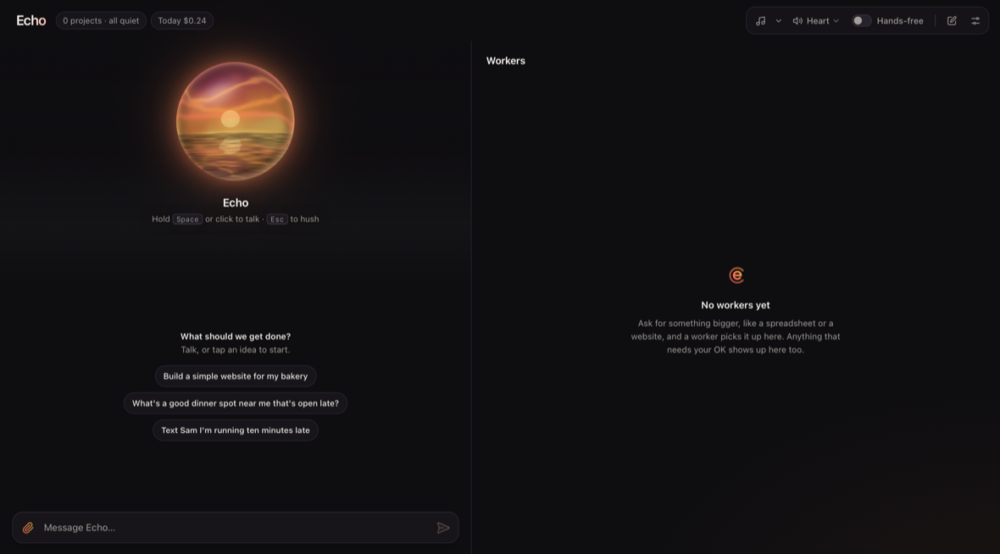
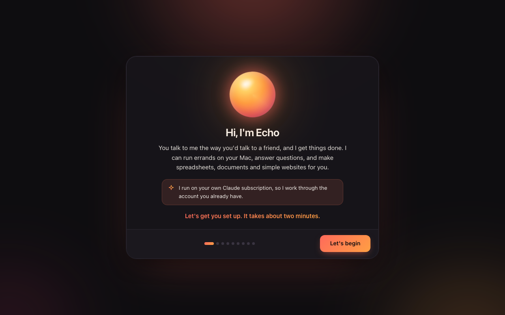
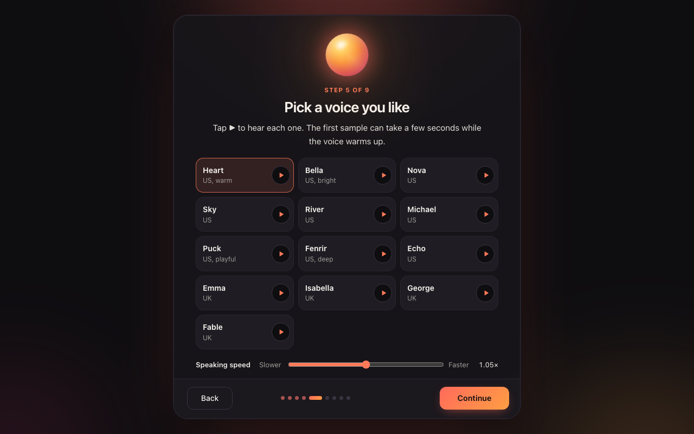
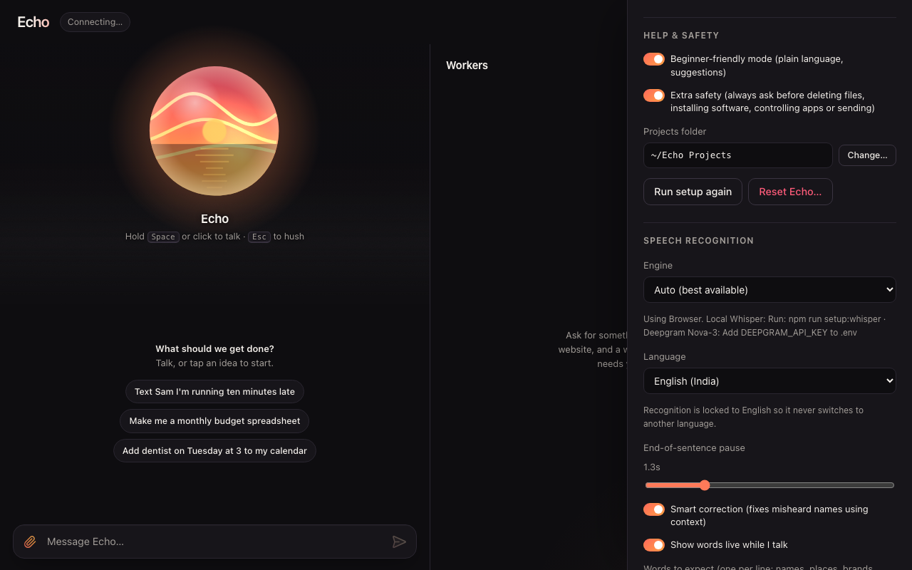

# Echo

**A voice assistant for your Mac.** You talk, Echo answers out loud, and it gets things done in the background: texts and calendar events, questions and research, spreadsheets and documents, and even simple websites. It runs on your own Mac and thinks with your own Claude account.



| Setup takes a few minutes | Pick a voice you like | Safety built in |
|---|---|---|
|  |  |  |

## What you need

- **A Mac** with a recent version of macOS and an internet connection.
- **A Claude subscription** (Claude Pro or Max, from [claude.ai](https://claude.ai)). Echo runs on Claude Code, which uses your subscription. You sign in once during setup, in your browser. Echo never sees your password.
- About 2 GB of free space (more with local speech recognition).

## Install (one line)

Open the **Terminal** app, paste this, and press Return:

```bash
curl -fsSL https://raw.githubusercontent.com/stoxtox/echo-assistant/main/install-remote.sh | bash
```

It downloads the latest release, checks its SHA-256 checksum, and sets everything up in `~/Applications/Echo`:

- **Node.js**, installed in your home folder (no password needed) if your Mac doesn't have it,
- Echo's building blocks,
- **Claude Code**, then the **Claude sign-in**: a browser window opens, you sign in with the account that has your Pro or Max subscription, and come back to Terminal,
- Echo's natural voice and, if you have [Homebrew](https://brew.sh), free private speech recognition (Whisper), with download progress,
- the **Echo app** in your Applications folder. It's built on your Mac with Apple's free Command Line Tools; if they're missing, the installer asks before Apple's installer opens. Without them, Echo opens in your browser instead.

Then Echo opens, and a short setup walks you through your name, a voice, and the permissions it needs (microphone, Contacts, Messages, Calendar). Running the same command again is safe: it only finishes what's missing and never touches your data.

Options go after `bash -s --`, for example `… | bash -s -- --skip-whisper --dir ~/Echo`. Add `--help` to see them all.

Prefer to click? Download `Echo-<version>.zip` from [Releases](https://github.com/stoxtox/echo-assistant/releases), unzip it and double-click `install.command`. [GETTING_STARTED.md](GETTING_STARTED.md) walks through it step by step.

## Updating

Echo checks for a new version once a day. When there is one, you'll see **Update available** with what's new, and an **Update now** button. You can also use **Settings → Updates → Check for updates**, or **Check for Updates…** in the Echo app's menu.

- Updates are verified with a SHA-256 checksum before anything changes.
- Your data and settings are never replaced.
- Running tasks pause and pick up where they left off.
- If a new version doesn't start properly, Echo goes back to the previous one by itself. You can also go back by hand in Settings → Updates.
- Turn on **Install updates automatically** in Settings if you'd rather not think about it.

## Privacy

- Echo runs on your Mac. Your conversations, memory, contacts favorites and settings stay in its `data` folder in `~/Applications/Echo` and are never uploaded anywhere by Echo.
- What you ask Echo goes to Claude through your own Claude account, the same as using Claude yourself.
- Speech recognition can run entirely on your Mac (Whisper). The voice (Kokoro) always runs on your Mac.
- Messages always show you a Send / Cancel card first, and in safe mode deleting files, installing software and controlling other apps always ask first.
- Every release is built from a clean copy and passes an automatic privacy check, so it never contains anyone's personal data.
- The only thing Echo asks the internet for by itself is GitHub, once a day, to see if there's a newer version.

## Uninstalling

1. In the menu bar, click Echo's icon and choose **Quit Echo** (or run `~/Applications/Echo/scripts/launcher.sh --stop`).
2. If you want to keep your data, copy `~/Applications/Echo/data` somewhere first.
3. Delete `~/Applications/Echo` and `~/Applications/Echo.app`, and remove Echo from the Dock if you added it.
4. Optional: Echo's projects are in `~/Echo Projects`; delete that too if you don't need your files. Node.js, Claude Code and Homebrew stay; remove them the usual way if you like.

## More

- [GETTING_STARTED.md](GETTING_STARTED.md): a friendly guide for your first day.
- [docs/REFERENCE.md](docs/REFERENCE.md): everything Echo can do and how it works.
- [CHANGELOG.md](CHANGELOG.md): what changed in each version.
